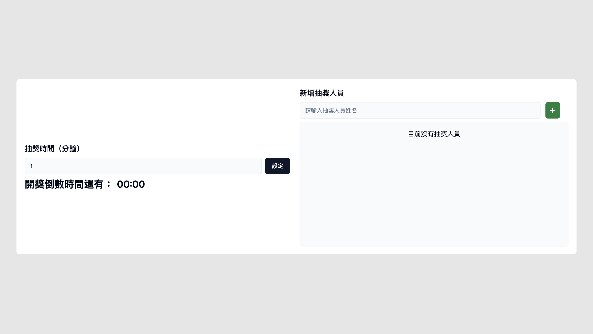

# draw-system

A simple countdown draw system developed using Next.js 14, TypeScript, Redux Toolkit, Tailwind CSS, and shadcn/ui.



## Demo

https://draw-system.vercel.app/

## Installation

Install my-project with npm

```bash
  $ git clone https://github.com/chingwu99/draw-system.git
  $ cd draw-system
  $ npm install && npm run dev
```
